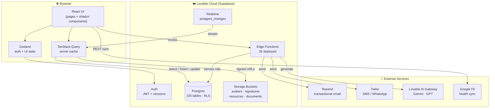

# Architecture Map

## Layered diagram



## Key principles

- **Frontend-first**: business logic in React + RPCs; no Node/Express server.
- **Edge functions** handle privileged operations (admin user creation, password reset, OTP verification, scheduled jobs, document signing, AI calls).
- **RLS everywhere**: every table is row-level secured; admins bypass via `is_admin(auth.uid())` SECURITY DEFINER.
- **Zustand + TanStack Query**: Zustand stores auth identity and UI flags only. All server data flows through React Query for cache + invalidation.
- **Mobile-first PWA**: installable; works on phone and tablet primarily; admin views are responsive desktop-friendly.

## Folder layout

```text
src/
├── pages/
│   ├── admin/        ← 79 admin pages
│   ├── seeker/       ← 75 seeker pages
│   ├── coaching/     ← 45 coach pages
│   └── public/       ← landing, login, register
├── components/
│   ├── ui/           ← shadcn primitives
│   ├── dashboard/    ← seeker home widgets
│   ├── admin/        ← admin shared widgets
│   └── docs/         ← Operation Docs viewer
├── hooks/            ← reusable data hooks (useDbSessions, useStreakCount...)
├── store/            ← Zustand stores (authStore, ...)
├── lib/              ← pure utilities (date, audio, validation)
├── data/             ← static seed data, mock content
├── docs/operation/   ← THIS docs bundle
└── integrations/supabase/ ← AUTO-GENERATED client + types

supabase/
├── functions/        ← 26 edge functions (Deno)
└── migrations/       ← versioned SQL schema
```
