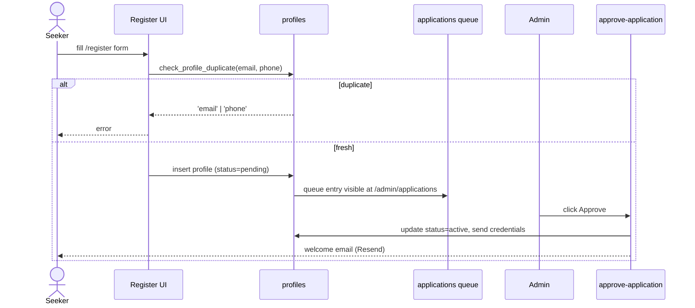
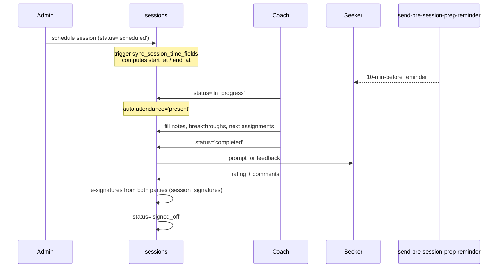
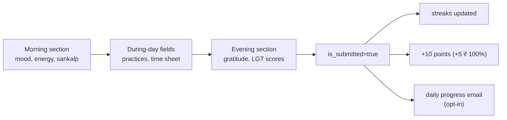
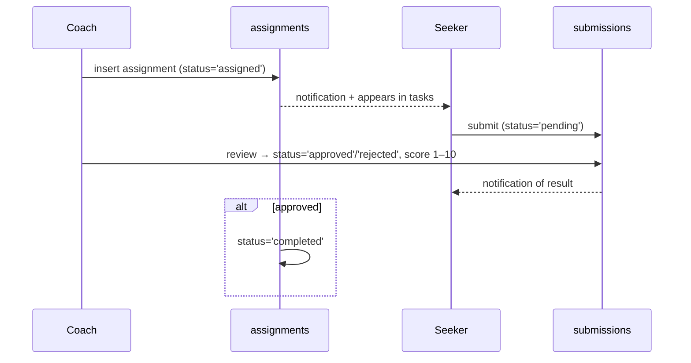
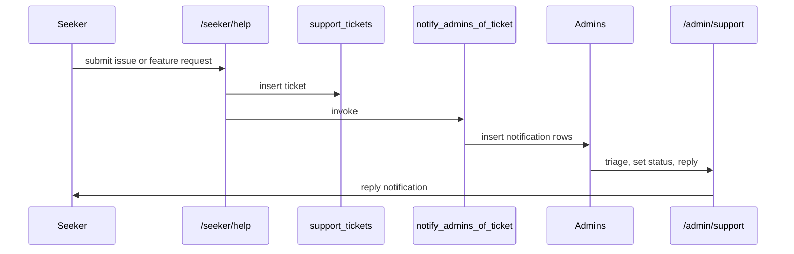
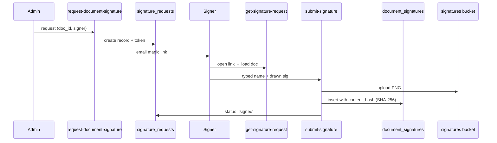

# Workflows

End-to-end flows that span UI, DB, and edge functions.

## 1) Seeker Registration & Approval

## 2) Onboarding (mandatory 6-step)

1. Welcome + identity confirmation
2. Coaching Agreement (e-signed)
3. Goal Commitment form
4. Personal History intake
5. LGT Initial Goal Setting (IGS) assessment — counts as Session #1
6. Tour the app (OnboardingTour overlay on `/seeker/home`)

Cannot access daily features until all 6 are complete.

## 3) Session Lifecycle

## 4) Daily Worksheet (Dharmic Worksheet)

## 5) Assignment Cycle

## 6) Support Ticket

## 7) Document Signing (e-signature)

## 8) Daily Cron Jobs

| Time (IST) | Function | Purpose |
|---|---|---|
| 06:00 | `send-daily-seeker-reports` | Yesterday's progress digest to opted-in seekers |
| 09:00 | `process-email-queue` | Drain Resend queue (pgmq) |
| 10:00 | `daily-session-report` | Email admins yesterday's session metrics |
| 20:00 | `send-evening-gratitude-nudge` | Push reminder to log gratitude |
| Continuous | `session-heartbeat` | Keep active sessions alive |
| Pre-session | `send-pre-session-prep-reminder` | 10-min warning to seeker + coach |
| Monthly | `rotate_encryption_keys` | Key rotation for PII encryption |
